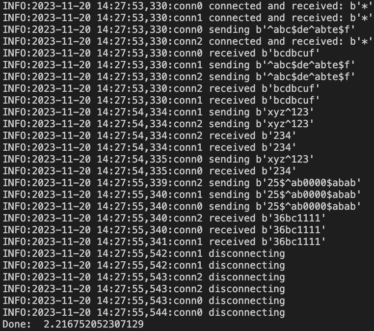

# Concurrent-Servers

At first, my goal was to try to use sockets (beej guild), but then I became interested in how they are used to develop web servers (eli guide).

1. Threaded-Server — representation of how threads are used to parallelize incoming connections.
2. Blocking and Non-blocking servers — demonstration of how non-blocking output allows processing of multiple connections using a single thread.
3. Select-Server — the `select` system call was used here. It enables multiplexing I/O. (But it's better to use `epoll`).
4. Uv-Server — server with using of `libuv` library that centered on the concept of **event-loop** and was develped for use by Node.js.

The client has several flags to select the host, port and number of threads. When successful, its log looks something like this:



## Run
### Servers
```
git clone https://github.com/plamyaa/concurrent-servers.git
cd concurrent-servers
make SERVER-NAME-HERE
./build/SERVER-NAME-HERE
```
### Client
```
python3 ./client.py -host localhost -port 9090 -n 3
```

## Sources
1. https://beej.us/guide/bgnet/
2. https://eli.thegreenplace.net/2017/concurrent-servers-part-1-introduction/

### Helpful articles
1. https://tproger.ru/translations/diversity-of-input-output-io
2. https://habr.com/ru/articles/336498/